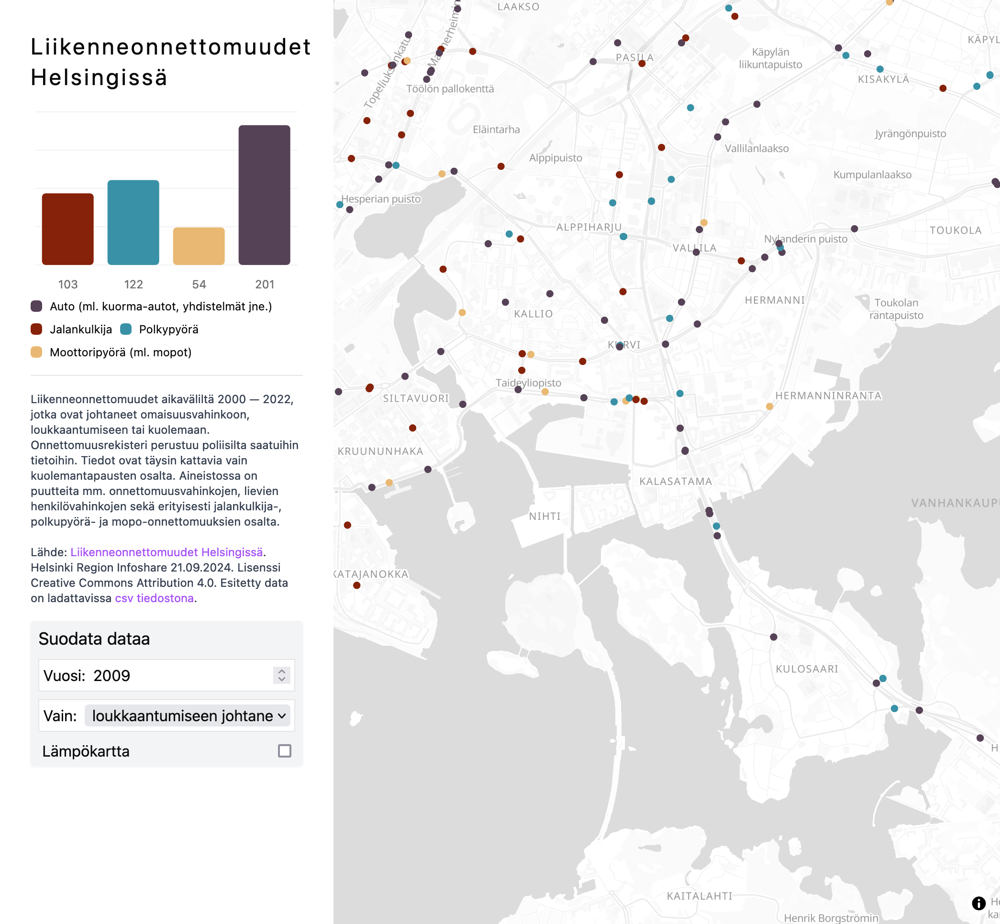

# Liikenneonnettomuudet Helsingissä

Map- and graph visualization of all known traffic accidents in Helsinki, Finland for years 2000 — 2022.

## Local development

1. Clone the repository with `gh repo clone jqpe/liikenneonnettomuudet`
2. Install Node.js
3. `corepack enable`
4. `corepack install` to install the package manager configured in package.json
5. `pnpm install`
6. `pnpm dev`
